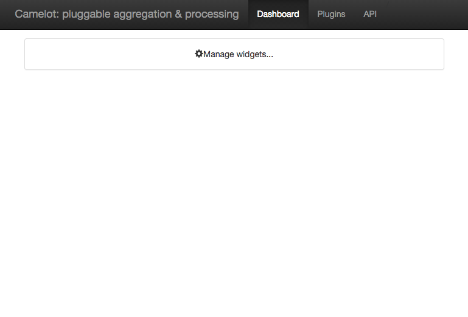
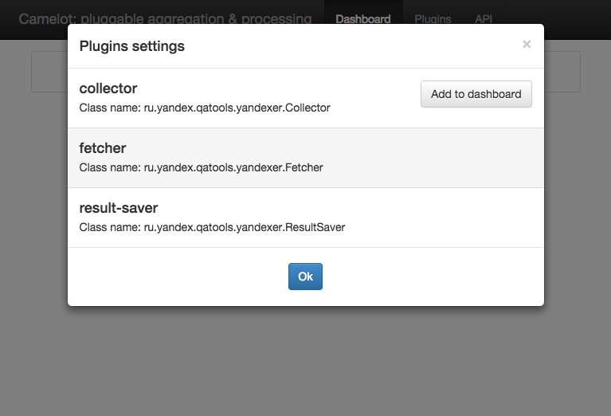
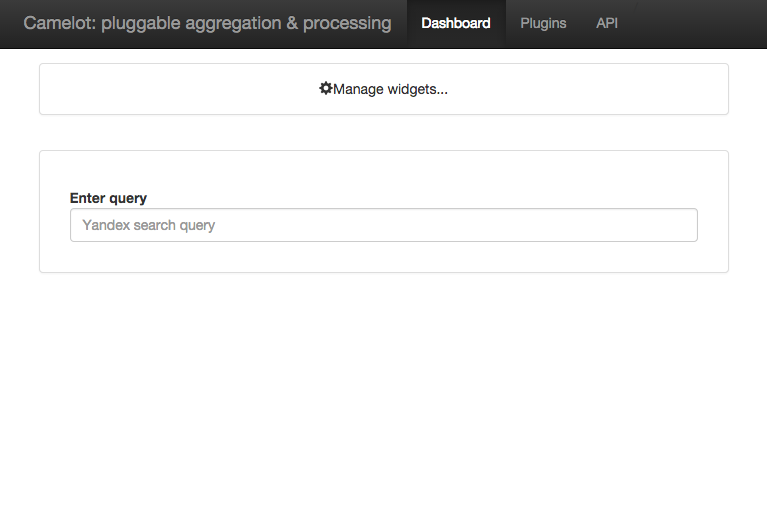
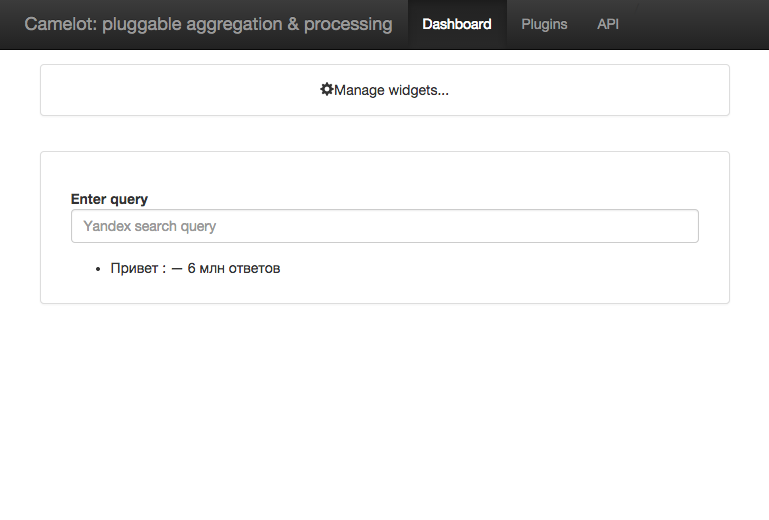

Yandexer
===
Приложение для получения количества результатов по поисковому запросу из Яндекса.
На вход поступает поисковый запрос, который поступает в очередь ActiveMQ. Из очереди
задания выполняются с использованием PhantomJS, а затем результат выполнения (число результатов поиска)
сохраняется в базу данных (PostgreSQL).

Для сборки приложения требуются:
* JDK >= 1.7
* Maven >= 3.2

Чтобы собрать проект нужно:

### 1. Склонировать проект
    ```
    git clone https://github.com/camelot-framework/camelot-yandexer.git
    ```

### 2. Составить конфигурационный файл `yandexer.properties`:

    * **jms.broker.list** - список брокеров, например `(tcp://localhost:61616)?randomize=false&priorityBackup=true`
    * **yandexer.jdbc.url** - URL-адрес подключения к базе данных, например `jdbc:postgresql://localhost:5432/postgres`
    * **yandexer.jdbc.user** - имя пользователя базы данных
    * **yandexer.jdbc.password** - пароль пользователя базы данных

    **PS:** конфигурационный файл должен находиться в корне проекта

### 3. Собрать проект. Для этого следует выполнить команду
    ```
    mvn clean compile
    ```
### 4. Запустить проект. Для запуска приложения требуется:
    * PhantomJS >= 1.9.0
    * PostgeSQL 9
    * ActiveMQ

    Далее следует выполнить следующую команду
    ```
    export MAVEN_OPTS="-XX:MaxPermSize=512m -Xmx2048m -Xbootclasspath/a:."
    mvn clean compile camelot-test:run
    ```
### 5. Открыть `http://localhost:8080/camelot` в браузере.


Дальше следует добавить виджет *Collector* на дашбоард.



Теперь можно поискать что-нибудь используя виджет. Количество найденых в Яндексе результатов отобразится ниже.


### 6. Эти данные сохраняются в базу данных в таблицу `results`
